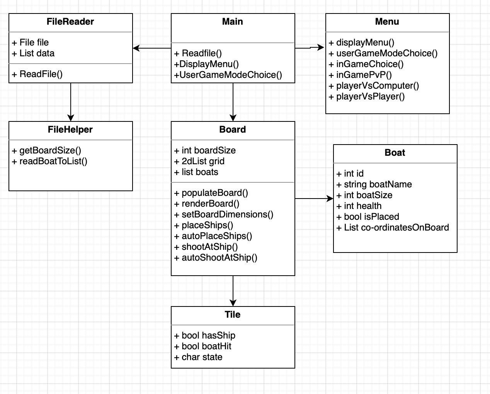

## ADA BATTLESHIPS GAME
###NOTE -
####Testing via replit may not work so instructions to set up locally using IntelliJ
#### 1. Pull code via github
#### 2. Find set up run configuration
#### 3. Choose a new configuration and pick 'application'
#### 4. Choose main class and run to build

##Challenge Outline
### Summary and review of the problem with overall proposed solution
#### The problem at hand was to make a battleships game. Breaking down the problem , there will need to be two boards for each player/ computer. Then each player needs to be able to place ships on the board at a certain co-ordinate. Then each player needs to be able to take shots at the other persons board until they are all destroyed. To make this slightly more complex the ships should be able to be auto placed and there should also be different game modes with different size boards. 
#### The solution with consist of different classes that each break down the problem for example a board class that allows boats to be placed on it or a boat class that tracks the status of different of the ships. The board will be a 2d list with objects of tiles that will track if ships have been placed or hit. There will be a user input that will take the co-ordinates and match that to the index in the list to check if a ship has been hit.    
### UML 

### Initial Working Plan
#### Initial working plan would be to split the tasks out. Classes will take the role of breaking down the problem in this instance. Each task will have its own class or function if that is more applicable.
#### Starting from the top the program flow will be controlled by the menu class where the user can choose which game mode they want to play. The menu class will call the other classes in respect to the game mode.
#### With most game modes two boards will be made by creating two instances of the board class. The menu will then prompt the user to place the ship which will invoke a board function which will then alter the different variables on the board and ship and deem the ship placed.
#### In terms of coding this was done with an iterative approach. There were many versions at the beginning of the program's life before the program took shape. Different versions were built until the base of the project was solid. Then functions were added as the project scaled, most of the program was built around the board class. The smaller the iterations the easier it was to test the program keeping with the principle of 'failing fast'. This is also an attempt to keep the code clean and simple by breaking down the problem to it's smallest form making it easier to read and test.
#### OOP was the main factor in the quality of code, using its main benefits to write clean code. One OOP fundamental includes encapsulation which is the process of hiding values or data inside a class, preventing unauthorised parties direct access to them. This was achieved in the code by keeping the functions private and having a single function that is public to interact with other private functions in order to avoid unnecessary calling upon functions that may affect data when it shouldn't be directly interacted with. The code also displays use of abstraction, which is the process of hiding data from the user that doesn't need to be seen. One example of this is when placing a ship manually or automatically. Placing a ship manually will display error warnings if ships are placed incorrectly. Auto placing ships uses the same functions but if the state of the functions are auto then the functions dont display error warnings to clean the format of the output.
#### Another attempt to make quality code is keeping functions as concise as possible and declaring as many variable locally as possible. By keeping code concise it makes it easier to debug, test and read code. By declaring as many local variables as possible this holds the same benefits but it also reduces the chances of the variable being incorrectly altered by other functions in the program causing errors that are difficult to debug.

### Epic Style Tasks
#### When analysing and breaking down the problems in to epics I have come up with the following: 
#### <ul> <li> Menu to control the user input for placing and shooting ships </li> <li> Create a board for the user to place the ships </li> <li> Place the ships on the board </li> <li> Shoot a ship on the board </li> <li> Read from txt file to set board and ship sizes </li> </ul>

### Initial OOP Design
#### As seen above in the UML design the OOP design was based around the epics. First of all, the menu class is where the boards are instantiated and player game modes are called. The menu's main function is to controll the flow of the game and how it is played, calling functions in certain orders to represent the game mode being played. 
#### The next and possibly most important class is the board. The board contains most of the epics as functions. I decided that as the functions were relatively small that they didn't need their own classes. So the board will contain epics like placing a ship and shooting a ship. However, validation will be done by a separate class the checks user inputs to reduce the size of the code in the board class and make it more readable and decrease duplicate code. The board class will contain a 2d list of tiles. The tile class is just a class that holds variables that can be used as the status of the board e.g. has a ship placed.

#### There is also a boat class that has the same concept as the tile class with just variables that hold a status of the ship. The actually boat will be represented by changing tile varialbes to signify the boat being placed at certain indexes on the board.

## Development
### Use Of Good Coding Standards
#### Internal documentation - the code does contain comments. Comments are up to date jargon free with attempts to not repeat comments when necessary for the ease of reading
#### Minimise code duplication - minimising code duplication was done by the use of functions, calling functions to minimise the need of rewriting code. Some functions are similar with duplicate lines of code, usually similar named variables but this was done to conserve the idea of keeping variables local where possible
#### Simplicity in logic and flow - simplicity in flow is achieved by controlling the flow through the menu class, where game modes are all called and other functions branch off of the class grouping all the flow together. Simplicity of logic was completed by breaking small tasks down in to functions, keeping concise clear code and logic
#### Naming conventions - all variables and functions were written in camel case. Names are related to the data or the functionality. They are all concise and to the point 
#### Formatting - all code follows a consistent format with indentations, spaces and logical grouping with code that serves the same functionality as each other
#### Spacing operators - all operators and delimiters are seperated with one space for ease of reading
#### Aligning braces - all braces are aligned when opened with the closing braces
#### Deep nested conditionals - this was avoided where possible with the user of the checker class to avoid unnecessary if statements. However, this could be something looked to improve with more time available as there are nested if's in the code that could possibly be refactored in later revisions.
#### One line instructions - all instructions where kept to one line where possible, which did also contribute to some of the nested if's but all instructions were kept to one line each
#### Lifetime and scope of variables - global variables are kept to a minimal, variables are local where possible and their lifetime scopes the life of the function calls keeping them as small as possible
#### Avoiding multi-purpose functions and variables - No function is called twice with a different purpose and the same with the variables, this is helped by keeping variable lifetime short and functions small clear and concise
#### Minimise forced type conversion - This could be a place of improvement within the code. There were a lot of String and int castings back and forth with taking user input for the co-ordinates and casting the input to int in order to access elements in the list
#### Testing - with following the approach of integrated development means the code needed to be tested often. After every function or task was written it was tested. Tests were manual and consisted of acceptance testing, extreme data and invalid data testing. This approach of testing often eliminated the chances of bigger bugs and making them harder to debug

### Code Reviews And Changes
#### code reviews were self completed upon the completion of each epic. Each code review would consist of checking the code against the use of good standards and how they could be added or code but be refactored to meet these standards. Whilst reviewing the code this is when I also did acceptance testing on the program to see if it actually completed the task. Initially, I intended to peer review with a classmate Ethan but work timetable clashed with plans so I didn't get a second opinion. Changes were made to the program after the reviews at each iteration and tests were made. Changes to the program were also made when certain functionalities were added and affected other pieces of code. Another benefit of programming in small chunks is that changes can be made in small amounts and regularly.
#### in the first development phase, the tasks were to create the base of the game meaning the board, boat and tile class. My goal was to create something where a ship could be placed on. I started with the board class creating a 2d list where elements could be placed and a tile class that would populate the board. I had to create a function that would set the dimensions of the board and then use another function to then populate the list with tile objects. In my first code review, there were no major problems with the code written but there was a problem with the potential scalability as I didn't consider how to dynamically change the size of the boards. This meant there needed to be a change in the way I read over the txt file and store it so the board size could either be small or large depending on the game mode.
#### in the second development phase, the task was now to be able to place and shoot at the ships on the board. My goal was to make functions that could do this by changing the elements on the board to represent whether a ship has been placed or destroyed. Also both of these functionalities should be able to be done automatically. In this code review, it was apparent that the code wasn't broken down in to small logical blocks and it wasn't very readable. Also the code broke when testing with invalid data making the game unplayable. Some changes had to be made to the code in this instance is to break the placing ships in to smaller blocks or code that can be reused for both manually and automatically placing the boats. Furthermore, the bugs in the code need to be fixed and try catch blocks need to be added to stop the code from breaking if the user enters something wrong.
#### in the third development phase, the tasks was to piece the game together, with all the functionality in place I needed to control the flow of the game. In the code review after the task, this is where I created the menu class where I called the different functions to make the game modes playable. I could see that when placing the ships automatically in the player vs computer mode it was triggering "cannot be placed there" error and displaying it to the user and made the output look messy. I passed a bool variable to the ship placing functions to determine whether it would display the error messages or not depending on if it was automatic or not, so there messages wouldn't be displayed to the user

### Quality through testing
#### Testing was done at every stage of development and done as often as possible. Through testing, I could ensure that the flow of the game was correct and there were no errors in the gameplay. I did this by manual testing with different types of data. 
#### Different types of tests were acceptance, invalid and extreme data tests. This was done to every function that took inputs from the user. Some errors were uncovered with the placing of the ship, co-ordinates were not being placed correctly due to the using the co-ordinates in the wrong order to access the elements in the list. This bug was resolved by using the debugger and breakpoints in the IDE, stepping through line by line watching the variables update. This was a logical error so didn't cause the program to break just act incorrectly.
#### Different tests were done to try and break the program. This was done by entering data that would not be expected by the program. For example, trying to place a co-ordinate outside of the size of the board. This type of testing is done to try and make the program as bulletproof as possible so the user cant cause any errors and break the program.
#### The main way I solved bugs was by using the debugger in the IDE. Going line by line using breakpoints to monitor variables after lines have been executed. By doing this it will reveal where the problem with the program is and make it easier to debug.

### Reflection on key design challenges
#### One of the key design challenges was automatically placing the ship. I had to create a function/s that would randomly generate co-ordinates which were valid but it also had to be dynamic as the board size can change. This meant that the co-ordinates had to randomly take different formats if the board size was greater than 10. E.g. 0A1H 0AA1H 0AA00H. To make sure that these unpredictable inputs are valid I had created a class with checkers for the input so it doesn't create more errors when playing the game. Also like stated before the placing auto placing ships function uses the same place ship function to actually place the ship after the function is called. This means that the place ship function needed a state so that it, like said before, can limit the outputs to the console if its state is in auto
#### Another key design challenge was making the board size dynamic. The easiest part was making the board 10x10 (for reference the grid is always a square) but going over the board size of 10 added more problems and increased the size of the code dramatically. One of the biggest problems was converting the co-ordinates with double characters in to an value that can be used with the index with the list. For example turning AB in to a number used for the index. Another problem to be seen is when checking an index going from a single to a double character the program needs to handle again the value for the index. To solve this I would loop through the co-ordinates and use a function to convert the letter to its equivalent digit e.g. A=0 B=1. If the size of the co-ordinate with the same type like AA went over 10 then the first character would equal 1 and the second digit would be converted like normal so in this case would equal 10. This would then be an acceptable number to index the list. Otherwise, it would have been 00 not 10.

## Evaluation
### Analysis
#### While coding, I did try to follow as many good coding practices as I could. However, like with anything this is always room to improve. I have tried to break down functions as much as possible in order to make them reusable, for example placing the ship. There was just one big function with all the functionality in one function. Instead, in a later revision that function was broken down in to smaller functions where they were split depending on length of the string used to place the co-ordinates. 
#### However, even still with trying to make the code as reusable as possible there was still quite a bit of duplicate code. With these functions having quite similar functionality but do slightly different things. For example one function adds a ship for format 0A0H and another would add ship format 0AA00H. The code is similar and does have duplicate lines of code and also variables with the same name and functionality as others in other functions. The duplicate lines were needed as the function does different things so couldn't be broken down anymore. The variables are redeclared locally for good coding practice.
#### Another thing that may be classed as smelly code and points in the program that could be refactored. This would be the actual size of the board class. The size of the class is quite significant in comparison to the other classes. It could be quite difficult to read at first glance but wasn't refactored due to time and I thought it would be easier to read all in one class than try to refactor and split the functions.  If I had more time I would abstract some of the board functions into other classes to make the code more readable. 

### Advanced programming principles
#### One pattern that I implemented most often with different examples would be the state pattern. My code wasn't written around this was implemented in functions on a smaller scale. For example and mentioned before, the placing ships functions. Depending on whether a bool parameter is true or false depends on the state of the function. If it is false then the function outputs everything to the console. If it is true then this represents the function being in auto state meaning the ships are being placed automatically. Therefore, there are only certain things that are outputted to the console and other things aren't displayed to the user.
#### On a smaller scale, I used the state pattern as a conditional in order to validate user inputs. In the checker class, examples can be seen using this pattern where a variable is used as a counter and if the counter is incremented then the next part of the code can be executed. Though this is on a smaller scale compared to the placing ships it still uses the pattern.

### Feature showcase
#### One feature that I would like to talk about is the auto placing and shooting functions within the game. I was happy with the way I could minimise the code written by using functions I had already written in the program. For example, the validating the random input has it's own function that checks whether the co-ordinates are a valid format to enter. Then I have the actual ship placing function which does the physical placing of the ship. This means that the code can be short and with minimal code duplication as all that needs to be done is generate random inputs. This function displays good coding standards as the code utilises lots of reusable functions from else where in the program making the code more efficient when reading and also trying to understand the logic. I think that this is a good example of OOP because it takes advantage of sharing pieces of code from other classes.
#### Another feature I would like to talk about is how the program handles reading data from the txt file. I have two classes for reading the data from the file, one is to read the data and store it and the other is to run checks on the data to make sure to only store what should be stored. The first class is quite simple and just loops through each line adding it to a list of strings. The second class then manipulates the strings in the list breaking down the strings and checking for certain criteria. For example, looking for the word boat, then checking for the name and size if the string contains boat. This way the user can type anything in to the txt file and if it doesn't fit the format the code is expected then it will be ignored making it more robust. Additionally, on top of that the data in the txt file is checked more in the board class. If any of the board values are greater or smaller than the bounds set then the program will set the size to the default value. For example, if someoone sets the board size to 100, this will exceed the bounds set so will set the size to the default size of 5. 

### Reflecti