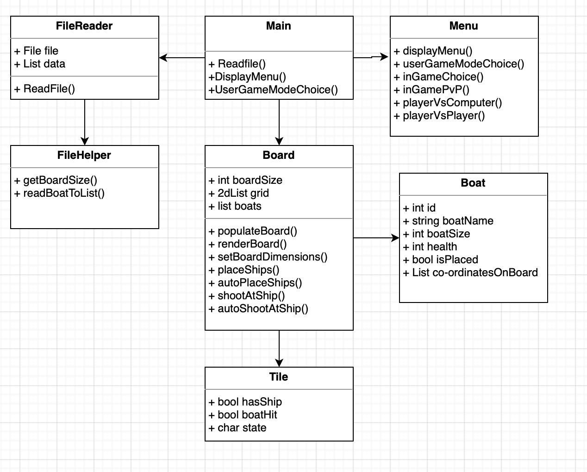

## ADA BATTLESHIPS GAME
###NOTE -
####Testing via replit may not work so instructions to set up locally using IntelliJ
#### 1. Pull code via github
#### 2. Find set up run configuration
#### 3. Choose a new configuration and pick 'application'
#### 4. Choose main class and run to build

##Challenge Outline
### Summary and review of the problem with overall proposed solution
#### The problem at hand was to make a battleships game. Breaking down the problem , there will need to be two boards for each player/ computer. Then each player needs to be able to place ships on the board at a certain co-ordinate. Then each player needs to be able to take shots at the other persons board until they are all destroyed. To make this slightly more complex the ships should be able to be auto placed and there should also be different game modes with different size boards. 
#### The solution with consist of different classes that each break down the problem for example a board class that allows boats to be placed on it or a boat class that tracks the status of different of the ships. The board will be a 2d list with objects of tiles that will track if ships have been placed or hit. There will be a user input that will take the co-ordinates and match that to the index in the list to check if a ship has been hit.    
### UML 

### Initial Working Plan
#### Initial working plan would be to split the tasks out. Classes will take the role of breaking down the problem in this instance. Each task will have its own class or function if that is more applicable.
#### Starting from the top the program flow will be controlled by the menu class where the user can choose which game mode they want to play. The menu class will call the other classes in respect to the game mode.
#### With most game modes two boards will be made by creating two instances of the board class. The menu will then prompt the user to place the ship which will invoke a board function which will then alter the different variables on the board and ship and deem the ship placed.
#### In terms of coding this was done with an iterative approach. There were many versions at the beginning of the program's life before the program took shape. Different versions were built until the base of the project was solid. Then functions were added as the project scaled, most of the program was built around the board class. The smaller the iterations the easier it was to test the program keeping with the principle of 'failing fast'. This is also an attempt to keep the code clean and simple by breaking down the problem to it's smallest form making it easier to read and test.
#### OOP was the main factor in the quality of code, using its main benefits to write clean code. One OOP fundamental includes encapsulation which is the process of hiding values or data inside a class, preventing unauthorised parties direct access to them. This was achieved in the code by keeping the functions private and having a single function that is public to interact with other private functions in order to avoid unnecessary calling upon functions that may affect data when it shouldn't be directly interacted with. The code also displays use of abstraction, which is the process of hiding data from the user that doesn't need to be seen. One example of this is when placing a ship manually or automatically. Placing a ship manually will display error warnings if ships are placed incorrectly. Auto placing ships uses the same functions but if the state of the functions are auto then the functions dont display error warnings to clean the format of the output.
#### Another attempt to make quality code is keeping functions as concise as possible and declaring as many variable locally as possible. By keeping code concise it makes it easier to debug, test and read code. By declaring as many local variables as possible this holds the same benefits but it also reduces the chances of the variable being incorrectly altered by other functions in the program causing errors that are difficult to debug.

### Epic Style Tasks
#### When analysing and breaking down the problems in to epics I have come up with the following: 
#### <ul> <li> Menu to control the user input for placing and shooting ships </li> <li> Create a board for the user to place the ships </li> <li> Place the ships on the board </li> <li> Shoot a ship on the board </li> <li> Read from txt file to set board and ship sizes </li> </ul>

### Initial OOP Design
#### As seen above in the UML design the OOP design was based around the epics. First of all, the menu class is where the boards are instantiated and player game modes are called. The menu's main function is to controll the flow of the game and how it is played, calling functions in certain orders to represent the game mode being played. 
#### The next and possibly most important class is the board. The board contains most of the epics as functions. I decided that as the functions were relatively small that they didn't need their own classes. So the board will contain epics like placing a ship and shooting a ship. However, validation will be done by a separate class the checks user inputs to reduce the size of the code in the board class and make it more readable and decrease duplicate code. The board class will contain a 2d list of tiles. The tile class is just a class that holds variables that can be used as the status of the board e.g. has a ship placed.
#### There is also a boat class that has the same concept as the tile class with just variables that hold a status of the ship. The actually boat will be represented by changing tile varialbes to signify the boat being placed at certain indexes on the board.

## Development
### Use Of Good Coding Standards
#### Internal documentation - the code does contain comments. Comments are up to date jargon free with attempts to not repeat comments when necessary for the ease of reading
#### Minimise code duplication - minimising code duplication was done by the use of functions, calling functions to minimise the need of rewriting code. Some functions are similar with duplicate lines of code, usually similar named variables but this was done to conserve the idea of keeping variables local where possible
#### Simplicity in logic and flow - simplicity in flow is achieved by controlling the flow through the menu class, where game modes are all called and other functions branch off of the class grouping all the flow together. Simplicity of logic was completed by breaking small tasks down in to functions, keeping concise clear code and logic
#### Naming conventions - all variables and functions were written in camel case. Names are related to the data or the functionality. They are all concise and to the point 
#### Formatting - all code follows a consistent format with indentations, spaces and logical grouping with code that serves the same functionality as each other
#### 